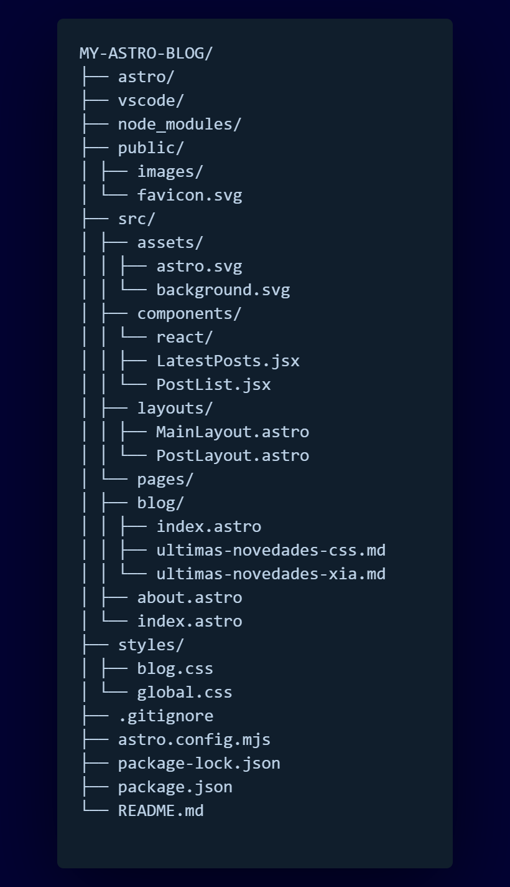

# Blog con Astro y React

Este proyecto es un blog personal construido con Astro y React que presenta una interfaz moderna y minimalista, optimizada para una excelente experiencia de usuario y rendimiento web.

## 🚀 Características

- Desarrollo híbrido con Astro y React
- Renderizado de Markdown para artículos de blog
- Búsqueda de publicaciones en tiempo real
- Diseño responsive para todos los dispositivos
- Vistas por categoría con filtrado de publicaciones
- Estilo personalizado para los posts en Markdown
- Últimas publicaciones destacadas en la página principal

## 📦 Estructura del Proyecto

## 🔧 Tecnologías utilizadas

- **Astro** - Framework web para sitios de contenido
- **React** - Biblioteca JavaScript para interfaces de usuario
- **Markdown** - Lenguaje de marcado ligero para contenido

**Nota:** Próximamente haré un despliegue con GitHub Pages.
# blog_Astro_React
